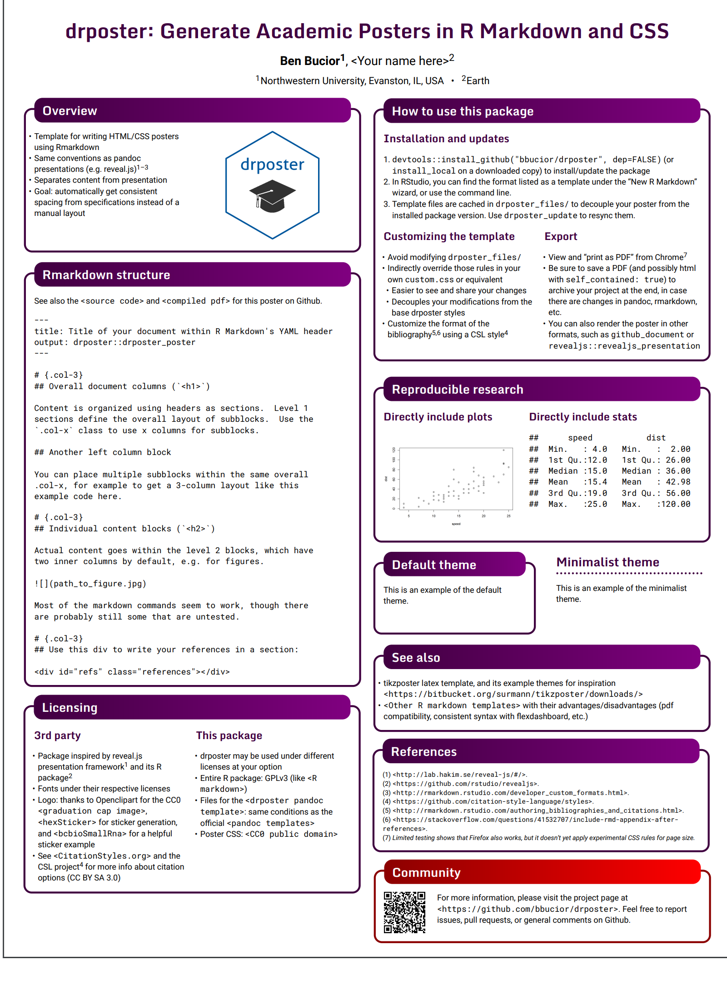

```{r setup, include=FALSE}
knitr::opts_chunk$set(echo = TRUE)

# colores
c0= "#b0394a"
c1= "#ad6395"
c2= "#a391c4"
c3= "#8acfe6"
c4= "#646420"
c5= "#db524f"
```


##  **Descripción actividad ** 

<br/><br/>

## **Construcción del Poster**

<br/>

### **Paso 1**

**R** posee librerias para la construcción de posters como : `posterdown`, `drposter`, las cuales despues de ser instaladas generan una plantilla que se puede obtener de la siguiente manera:

<br/>
**File** / **New File** / **Rmarkdown** / **From Template** / Posterdown HTML {posterdown}

```{r, echo=FALSE, out.width="100%", fig.align = "center"}
knitr::include_graphics("img/poster4.png")
```

<br/><br/>

#### **Ejemplo poster en Rmd**

```{r, echo=FALSE, out.width="100%", fig.align = "center"}

```

#### **Nota**

* [Qué es un poster científico](https://es.wikipedia.org/wiki/P%C3%B3ster_cient%C3%ADfico)
* El poster deberáser construido en  un formato  **A1**  

<br/><br/>

#### **Paso 2**

Cada estudiante aportará al trabajo realizado por uno de sus compañeros mediante dos contribuciones:

* **plus** : realizará por lo menos un aporte que permita mejorar el trabajo sustancialmente y que aun no está claramente incorporado al trabajo

* **delta** : dentro de los elementos contenidos  en el trabajo deberá realizar sugerencias que lo potencie para un mejor resultado

Nota: Esta actividad será realizada el dia 12 de abril y los pares se asignarán en la misma sesión.

<br/><br/>

### **Contenido del Poster**

* Origen de la distribución
* Características principales : f(x), F(x), E[X], V[X], representación gráfica....
* Ejemplo con enunciado, solución y sintaxis en R
* Aplicaciones en el campo de las ingeniería, ciencias, economía, salud...
* Relaciones entre distribuciones univariadas. [(Artículo)](http://www.stat.rice.edu/~dobelman/courses/texts/leemis.distributions.2008amstat.pdf)
* Referencias bibliográficas 


<br/><br/><br/>

## **Modelos**

### **Tabla 1 : Modelos de probabilidad** 

<br/><br/>

|num         | Distribución     |   num  |  Distribución         |
|:----------:|:-----------------|:-------| :---------------------|
| 1          | binomial   	    | 2      | Poisson               |	
| 3          | hipergeométrico  | 4      | geométrico o de Pascal|	
| 5          | binomial negativo| 6      | uniforme              |	
| 7          | normal	          | 8      | exponencial           |	
| 9          | gamma	          | 10     | Weibull               |
| 11         | Cauchy           | 12     | lognormal	           |
| 13         | beta             | 14     | Erlang	               |
| 15         | Gumbel	          | 16     | logistic              |


La asignación se realizará por sorteo en sesión de clase el dia lunes 10  de abril  de 2023. A los estudiantes no presentes el profesor realizará la asignatura de la distribución

<br/><br/>

### **Entrega y presentación de posters** 

*  Abril  14 de 2023

<br/><br/><br/>

### **Asignación de distribuciones**

<br/>

### **Tabla 2 : Asignación de id por estudiante**

|	id	|	nombre	                         |
|----:|:---------------------------------|
|	1	|	Pedroza Barrios,Edinson Steve	     |
|	2	|	Abadia Caballero,Carlos Adolfo	|
|	3	|	Arcila Avirama,Santiago	|
|	4	|	Aristizabal Figueroa,Duvan Esteban	|
|	5	|	Aristizabal Murillo,Juan Sebastian	|
|	6	|	Bejarano Osorio,Anny Victoria	|
|	7	|	Benavides Ocampo,Laura Sofia	|
|	8	|	Bolaños Santacruz,Santiago	|
|	9	|	Buitrago Orozco,Maria Jose	|
|	10	|	Cabrera Cardona,Darwin	|
|	11	|	Chavarriaga Delgadillo,Valentina	|
|	12	|	Diaz Sarabia,Denisse Valentina	|
|	13	|	Gomez Cifuentes,Diego Francisco	|
|	14	|	Gomez Pavajeau,Marianne	|
|	15	|	Gonzalez Noreña,Juan Pablo	|
|	16	|	Herrera Viveros,Fulvio Alexander	|
|	17	|	Martinez Luque,Juan Esteban	|
|	18	|	Mendez Camelo,Juan Jose	|
|	19	|	Monroy Lasso,Juan	|
|	20	|	Montero Guzman,Marlon Damian	|
|	21	|	Ortega Bastidas,Santiago	|
|	22	|	Perez Roman,Kevin	|
|	23	|	Peña,Yony Alejandro	|
|	24	|	Ramírez Salazar,Katherine	|
|	25	|	Restrepo Maldonado,Karol Daniela	|
|	26	|	Rojas Gomez,Maria Camila	|
|	27	|	Saya Home,Maria Camila	|
|	28	|	Taborda Madrid,Jhon Alejandro	|
|	29	|	Valencia Rojas,Sebastian	|
|	30	|	Vasquez Campiño,Maria Natalia	|
|	31	|	Vergara Burbano,Fabio	|
|	32	|	Avila Preciado,Ashley Karoline	|
|	33	|	Bados Armero,Miguel Angel	|
|	34	|	Bernal Castillo,Maria Camila	|
|	35	|	Burgos Alvarez,Brayan Alexander	|
|	36	|	Castaño Rueda,Allison Tatiana	|
|	37	|	Duque Gonzalez,Juan Jose	|
|	38	|	Gomez Paz,Santiago	|
|	39	|	Gualdron Lopez,Diego Alejandro	|
|	40	|	Legarda Betancourth,Deivy Hernan	|
|	41	|	Londoño Arciniegas,Mateo	|
|	42	|	Muñoz Sanchez,Juan Fernando	|
|	43	|	Ocoro Perez,Juan Tomas	|
|	44	|	Ordoñez Loboa,Juan Alejandro	|
|	45	|	Ordoñez Meneses,Laura Catalina	|
|	46	|	Rosero Fernandez,Juan Sebastian	|
|	47	|	Segura Hoyos,Carlos Andres	|
|	48	|	Silva Vinasco,Santiago	|
|	49	|	Unigarro Pabon,Juan Daniel	|


<br/><br/>

### **Asignación modelo**

### **Tabla 3 : Asignación de distribución por id**

|	id   |  modelo| id   |modelo  | id   |modelo  |  id    |modelo  |
|:----:|:------:|:----:|:------:|:----:|:------:|:------:|:------:|
|	1	   |	9	    |	13	 |	10	  |	25	 |	10	  |  37    |  7     |
|	2	   |	14	  |	14 	 |	15	  |	26	 |	1	    |  38    |  2     |
|	3	   |	11	  |	15	 |	1	    |	27	 |	5	    |  39    |  3     |
|	4	   |	2	    |	16	 |	2	    |	28	 |	8   	|  40    |  5     |
|	5  	 |	7	    |	17	 |	9	    |	29	 |	3	    |  41    | 12     |
|	6	   |	3	    |	18	 |	12	  |	30	 |	11	  |  42    |  8     |
|	7	   |	16	  |	19	 |	4	    |	31	 |	12  	|  43    | 13     |
|	8	   |	4	    |	20	 |	7	    |	32	 |	5	    |  44    |  9     |
|	9	   |	16	  |	21	 |	6	    |	33	 |	7	    |  45    | 14     |
|	10	 |	3	    |	22	 |	15	  |	34	 |	14 	  |  46    | 15     |
|	11	 |	6	    |	23	 |	13	  |	35	 |	5	    |  47    | 16     |
|	12	 |	8	    |	24	 |	1	    |	36	 |	13	  |  48    |  6     |
|      |        |      |        | 37   |   8    |  49    | 10     |


<br/><br/>

#### **Nota**:

Como ejemplo da la asignación de los modelos, el **id = 1** corresponde al primer estudiante de la **Tabla 2**  (Pedroza Barrios,Edinson Steve)  al cual le corresponde el **modelo 9** : gamma** de la **Tabla 1**. Lo cual indica que a  le corresponde realizar un poster sobre el modelo gamma


