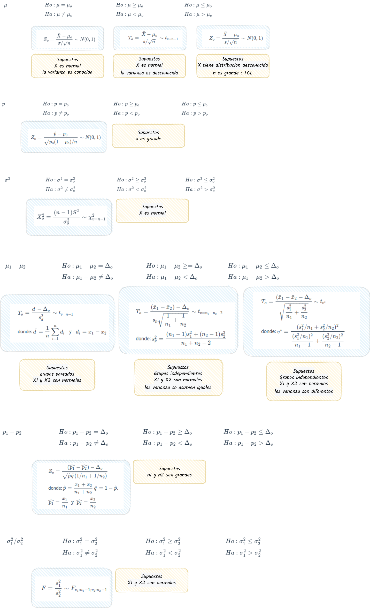

```{r setup, include=FALSE}
knitr::opts_chunk$set(comment = NA)

# colores
c0= "#b0394a"
c1= "#ad6395"
c2= "#a391c4"
c3= "#8acfe6"
c4= "#646420"
c5= "#db524f"
```


<br/><br/>

# **Taller 431**

<br/><br/>

## **punto 1**

Suponga que se estudia la compra de una nueva maquina para una empresa. Se comprará si la proporción de la producción que necesita ser reprecesados por tener defectos es inferior al 5%. Se examina una muestra de 40 artículos construidos por la máquina y 3 necesitan ser reprocesados.  ¿Que decisión se toma? (Se compra o no la máquina?)

<br/>

|                       |
|:----------------------|
| $Ho$ : $p \geq 0.05$  |
| $Ha$ : $p < 0.05$     |

<br/>

```{r }
prop.test(x=3,n=40, p=0.05, conf.level=0.95, alternative = "less")
```

<br/><br/>

**Conclusión**

Como el `p-value = 0.6416` > $\alpha$, no rechazamos $Ho$, no existe suficiente evidencia en la muestra que permita su rechazo, asumimos que $Ho$ es verdadera.

Debido a que no se pudo confirmar que la maquina produce menos del 5% de articulos defectuosos, se recomienda no comprar la máquina

<br/><br/><br/>

## **punto 2**

<br/>
Suponga que una empresa desarrolla un curso de entrenamiento para sus empleados, formando dos grupos y aplicándoles dos métodos distintos de entrenamiento. El primer grupo lo componen 36 empleados, mientras que el segundo grupo por 40 empleados. Los resultados en calificaciones entre 0 y 10, se presentan a continuación:

<br/>

```{r }
c2="#6666FF" # AZUL  
c3="#4CBFBA" # VERDE CLARO  

g1=c(6.2,  5.0,  6.9,  7.5,  8.6,  9.0,  7.0,  6.3, 9.9,  7.2,  8.1,  6.3,  5.2,  7.7,  5.7,  7.1,  6.4,  7.1,  8.3,  8.2,  6.4,  7.0,  7.8,  6.9,  8.5,  7.7,  8.2,  5.9,  9.8,  5.9,  6.7,  6.3,  6.7,  5.4,  7.2,  6.4)

g2=c(8.2,  6.7,  7.6,  8.3,  9.4,  7.3,  6.7,  7.2,  9.8,  9.6,  8.9,  7.3,  9.7,  7.9,  9.1,  9.0,  9.2, 7.4,  8.3,  8.6,  8.5,  9.2,  7.0,  6.6,  8.4, 8.3,  7.5,  6.8,  7.0,  7.3, 8.9,  6.2,  7.1,  8.5, 9.1,  7.9,  8.1,  8.6,  6.8,  9.0)

par(mfrow = c(1, 2))
boxplot(g1, las=1, col = c2, ylim=c(0,10))
boxplot(g2, las=1, col = c3, ylim=c(0,10))

```

<br/>

En este caso se trata de una comparación de medias, para grupos independientes.

|                            |
|:---------------------------|
| $Ho$ : $\mu_1  = \mu_2$   |
| $Ha$ : $\mu_1 \neq \mu_2$  |
| |

<br/>

Antes de proceder a realizar la prueba de hipótesis debemos de verificar algunos supuestos.

i) Supuesto de normalidad

|                                        |
|:---------------------------------------|
| $Ho$ : $X_1 \hspace{.3cm} \sim norm$   |
| $Ha$ : $X_1 \hspace{.3cm}no \sim norm$ |
|                                        |

```{r}
shapiro.test(g1) 
shapiro.test(g2) 
```
<br/>

En el caso de $X_1$ la prueba de Shapiro-Wilk arroja un `p-value = 0.5069`, lo cual indica que podemos asumir que la variable $X_1$, se distribuye normal. Igual ocurre con el resultado de la prueba para la variable $X_2$ (`p-value = 0.1533`)

Ahora se realiza la prueba de hipotesis para determinar si las varianzas de los dos grupos son iguales o diferentes

<br/>
|                            |
|:---------------------------|
| $Ho$ : $\sigma_{1}^{2}  = \sigma_{2}^{2}$   |
| $Ha$ :  $\sigma_{1}^{2}  \neq \sigma_{2}^{2}$  |
| |

```{r }
var.test(g1,g2) 
```
En este caso el resultado (`p-value = 0.2643`) indica que no se rechaza $Ho$, la muestra no da suficiente evidencia estadística para rechazarla, asumimos que las varianzas son iguales

Con este resultado y sabiendo que los datos corresponden a grupos independientes realizamos la seguiente prueba

```{r }
t.test(g1,g2,                 # variables 
       paired=FALSE,          # grupos independientes
       var.equal=TRUE,        # varianzas iguales
       conf.level=0.95)       # alpha = 0.05
```
Conclusión

Como el `p-value = 0.0002975` , rechazamos $Ho$, aceptamos Ha como verdadera. $\mu_1 \neq \mu_2$. Ahora podemos valorar las hipótesis


|                            |
|:---------------------------|
| $Ho$ : $\mu_1  \geq \mu_2$   |
| $Ha$ : $\mu_1 < \mu_2$  |
| |

```{r}
t.test(g1,g2,                 # variables
       paired=FALSE,          # grupos independientes
       var.equal=TRUE,        # varianzas iguales
       conf.level=0.95,       # alpha = 0.05
       alternative = "less")  # hipótesis alterna menor que (cola inferior)
```
Con este resultado podemos concluir que $\mu_1 < \mu_2$, lo cual indica que el segundo grupo obtuvo un mejor rendimiento que el primer grupo. Se puede concluir que el método empleado con el segundo grupo genera mejores resultados.

<br/><br/><br/>

## **punto 3**

Los ingenieros de una ensambladora de automóviles requieren decidir sobre cual de dos de las marcas de neumáticos de  deben comprar. La marca FB o la marca KT. Con el fin de tomar una decisión basada en evidencias estadísticas, deciden realizar un experimento en el que usan 12 neumáticos de cada marca. Los neumáticos se utilizan hasta su terminación . Los resultados   obtenidos (en miles de kilometros) se presentan a continuación :


```{r }
c2="#6666FF" # AZUL  
c3="#4CBFBA" # VERDE CLARO  

FB=c(41.8, 41.6, 31.5, 48.7, 40.8, 31.2, 36.5, 36.2, 32.8, 36.3, 38.6, 30.5)
KT=c(40.5, 38.4, 44.0, 34.9, 44.0, 44.7, 44.0, 47.1, 39.8, 43.9, 38.5, 40.2)
par(mfrow = c(1, 2))
boxplot(FB, las=1, col = c2, ylim=c(0,50))
boxplot(KT, las=1, col = c3, ylim=c(0,50))
```

¿Cual de las marcas de neumáticos recomendaría comprar? ¿Que supuestos deberá confirmar?. Utilice un $\alpha=0.05$


|                                  |
|:---------------------------------|
| $Ho$ : $\mu_{_{FB}}  = \mu_{_{KT}}$    |
| $Ha$ : $\mu_{_{FB}} \neq \mu_{_{KT}}$  |
|                                  |

Como en los casos anteriores para una comparación de medias, suponiendo que las variables presentan una distribución normal ( conocimiento previo de este tipo de variables), procedemos a realizar una prueba de comparación de varianzas

|                                                  |
|:-------------------------------------------------|
| $Ho$ : $\sigma_{_{FB}}^{2}  = \sigma_{_{KT}}^{2}$      |
| $Ha$ :  $\sigma_{_{FB}}^{2}  \neq \sigma_{_{KT}}^{2}$  |
|                                                  |

```{r}
var.test(FB,KT) 
```
`p-value = 0.1589`, resultante del contraste indica que podemos decir que las varianzas se asumen iguales

Ahora procedemos a realizar el contraste de medias

```{r}
t.test(FB,KT,                 # variables 
       paired=FALSE,          # grupos independientes
       var.equal=TRUE,        # varianzas iguales
       conf.level=0.95)       # alpha = 0.05
```
`p-value = 0.0254`, indica que podemos rechazar $Ho$, aceptamos como verdadera $Ha$, $\mu_{_{FB}} \neq \mu_{_{KT}}$

Con este resultado procedemos a realizar una prueba de cola inferior

```{r}
t.test(FB,KT,                 # variables 
       paired=FALSE,          # grupos independientes
       var.equal=TRUE,        # varianzas iguales
       conf.level=0.95,       # alpha = 0.05
       alternative = "less"  )
```
`p-value = 0.0127`, nos indica que se rechaza $Ho$, se acepta $Ha$ como verdadera, las llantas KT tienen un mayor rendimiento promedio que las llantas FB. Se recomienda la compra de las llantas KT.

<br/><br/><br/>

## **punto 4**

Un ingeniero desea establecer si existen diferencias entre dos métodos diferentes de realizar el ensamble de una casa prefabricada. Para comprobarlo recogen información del tiempo empleado en el ensamble de una pieza para ambos métodos en horas, los cuales se presentan a continuación:


```{r }
c2="#6666FF" # AZUL  
c3="#4CBFBA" # VERDE CLARO  

met.nue=c(32, 37, 35, 28, 41, 44, 35, 31, 34) 
met.est=c(35, 31, 29, 25, 34, 40, 27, 32, 31)

par(mfrow = c(1, 2))
boxplot(met.nue, las=1, col = c2, ylim=c(0,45))
boxplot(met.est, las=1, col = c3, ylim=c(0,45))

```

Presentan los datos suficiente evidencia que permita afirmar que el nuevo método es mas eficiente que el método estándar? (Utilice un  $\alpha=0.05$)

<br/><br/><br/>

## **punto 5**

El director de un gimnasio quiere determinar si un instructor de ejercicios debe ser contratado o no para su campaña estrella "Reducción de peso". Para tomar la decisión indica a un candidato que pruebe con 16 personas que asisten habitualmente al gimnasio. Los siguientes datos corresponden a los pesos tomados al inicio del programa ($x1$) y sus pesos al finalizar el programa ($x2$)

```{r }

x1=c(104, 89, 84, 106, 90, 96, 79, 90, 85, 76, 91, 82, 100, 89, 121, 72)
x2=c( 98, 85, 85, 103, 88, 95, 79, 90, 82, 76, 89, 81,  99, 86, 111, 70)

```

¿Que supuestos se deben verificar? ¿Se podría decir que las rutinas empleadas por el instructor producen los efectos indicados?  

<br/><br/><br/>

## **punto 6**

Se realizan pruebas de un nuevo lector láser manual para uso en la realización de inventarios y del lector utilizado actualmente, con el fin de decidir si se adquiere el primero. Se obtienen los datos  sobre el número de códigos de barra leídos por segundo con el cada uno de los dispositivos.

```{r }
c2="#6666FF" # AZUL  
c3="#4CBFBA" # VERDE CLARO  

lec.nue=c(35, 40, 36, 42, 41, 52, 36, 41, 49, 41, 45, 38, 31, 54, 37, 47, 38, 34, 46, 39, 45, 44, 41, 42, 36, 43, 35, 31, 38, 38, 41, 41, 44, 44, 35, 44, 38, 33, 38, 49, 45, 45,  38, 46, 28, 40, 41, 47, 43, 50, 39, 36, 39, 38, 37, 37, 47, 37, 41, 40, 35)
lec.act=c(41, 33, 22, 27, 31, 25, 28, 36, 29, 32, 25, 31, 31, 30, 31, 36, 26, 29, 29, 26, 27, 27, 30, 34, 26, 30, 23, 22, 29, 31, 37, 32, 34, 25, 25, 36, 32, 30, 23, 31, 33, 27, 27, 29, 35, 36, 27, 29, 25, 34, 27, 25, 32, 37, 31, 33, 27, 31, 26, 25, 24)

par(mfrow = c(1, 2))
boxplot(lec.nue, las=1, col = c2, ylim=c(0,60))
boxplot(lec.act, las=1, col = c3, ylim=c(0,60))
 
shapiro.test(lec.nue) 
shapiro.test(lec.act)  
var.test(lec.nue, lec.act) 
t.test(lec.nue,lec.act,  paired=FALSE, var.equal=TRUE, conf.level=0.95, alternative = "greater")
```

De acuerdo con la información, es posible preferir alguno de ellos?
¿Que supuestos se deben verificar?

<br/><br/><br/>

## **punto 7**

Un empresario registro el número de artículos producidos durante 10 días  para un grupo conformado por 15 obreros los cuales tienen un salario fijo (grupo 1). El gerente piensa que si se cambia la forma del salario tendrán mejores resultados. Para verificarlo introduce cambios en la forma de pago a un segundo grupo (grupo 2) . El numero de artículos producidos por ambos grupos son los siguientes: 

```{r }
c2="#6666FF" # AZUL  
c3="#4CBFBA" # VERDE CLARO  

g1=c(75, 76, 74, 80, 72, 78, 76, 73, 72, 75)
g2=c(86, 78, 86, 84, 81, 79, 78, 84, 88, 80)

par(mfrow = c(1, 2))
boxplot(g1, las=1, col = c2, ylim=c(70,90))
boxplot(g2, las=1, col = c3, ylim=c(70,90))

# dos poblaciones, de grupos independientes
# Ho: var1 = var2
# Ha: var1 != var2 
var.test(g1,g2) # como el valor-p >> alpha, no rechazamos Ho, asumimos que las varianzas son iguales

# Ho: mu1 >= mu2 
# Ha: mu1 <  mu2 
t.test(g1,g2,  paired=FALSE, var.equal=TRUE, conf.level=0.95, alternative = "less")

```

Suponiendo que los salarios pagados a ambos grupos son equivalentes, se podría afirmar que el plan de incentivos es efectivo? ¿Que supuestos se deben verificar? 

<br/><br/><br/>

## **punto 8**

La pizzeria P20 realizó el mes pasado una encuestas ($n_1=200$) para determinar la proporción de clientes que prefieren el tamaño familiar. La encuesta recogida muestra que el 20% de sus clientes prefieren el tamaño familiar. Con el fin de aumentar las ventas, realiza una estrategia de publicidad en redes. Pasado dos meses de la campaña la empresa realizó una segunda encuesta ($n_2=200$), obteniendo en este caso una proporción de  25%.

De acuerdo con los resultados podría decirse que la campaña realizada es efectiva? (utilice un $\alpha=0.05$)

```{r }
prop.test(c(40,50), c(200,200),  conf.level = 0.95)
```

<br/><br/><br/>


# **Taller 432**

<br/><br/>

## **punto 1**

Se lanza una moneda hasta que sale una cara y se reguistra el número de lanzamientos $X$. Depués de repetir el experimento 256 veces, se observan los siguientes resultados:

| $x$  | 1   |  2  |  3  |  4  |  5  |  6  |  7  |  8  |
|:----:|:---:|:---:|:---:|:---:|:---:|:---:|:---:|:---:|
|$f(x)$|  136|   60|   34|   12|    9|    1|    3|    1|


A un nivel de significancia de $0.05$ pruebe la hipótesis de que la distribución observada de $X$ se puede ajustar a una distribución geometrica `geom(x, 0.50)`, para $x=1,2,3,4,5....$

<br/><br/><br/>

## **punto 2**

Una muestra aleatoria de 90 adultos se ckasifica de acuerdo al genero y el número de horas que dedica a ver la televisión durante una semana:

|         genero   | Masculino      | Femenino         |
|-----------------:|:--------------:|:----------------:|
| más de 25 horas  | 15             | 29               |
| menos de 25 horas| 27             | 19               |

Utilice un nivel de significancia del $0.01$ y pruebe la hipótesis de que el tiempo dedicado a ver televisión es independiente de si el espectador es hombre o mujer.

<br/><br/><br/>

## **punto 3**

Un investigador realizó un estudio para determinar si la incidedencia de cierto tipo de delitos varia de una parte de una gran ciudad a otra. Los crímines específicos de interés eran el asalto, el robo de casas, el hurto y el homicidio. La siguiente tabla muestra el número de delitos cometidos en cuatro áreas de la ciudad durante el año pasado:


|Comuna | Asalto |Robo en casa| Hurto   | Homicidio|
|:-----:|-------:|-----------:|--------:|---------:|
|   1   |162     | 118        | 451     | 18       |
|   2   |310     |196         | 996     | 25       | 
|   3   |258     |193         | 458     | 10       |
|   4   |280     |175         | 390     | 19       |

¿ A partir de los datos podemos concluir, a un nivel de significancia del $0.01$ que la ocurrencia de estos topos de delitos dependen de la comuna de la ciudad?

<br/><br/><br/>

## **punto 4**

Se lleva a cobo una investigación en dos ciudades del Valle para determinar la opinión de los votantes respecto a dos candidatos a la presidencia paras proximas elecciones presidenciales. En cada cuidad se seleccionaron 500 personas votantes al azar y se registraron los siguientes datos :


|Opinión del votante | Ciudad 1    |     Ciudad 2 |
|:------------------:|------------:|-------------:|
| a favor de **A**   |          204|          225 |
| a favor de **B**   |          211|          198 |
| indeciso           |           85|           77 |


A un nivel de significancia del $0.05$ pruebe la hipótesis nula de quelas las proporciones de votantes que estan a favor del candidato **A**, del candidato **B** o están indecisos son las mismas para cada ciudad.  

<br/><br/><br/>

## **punto 5**

El departamento de Bienestar Universitario realizó un estudio para determinar si 8 semanes de entrenamiento realmente reducen los niveles de colesterol de los participantes . A un grupo de tratamiento que consta de 15 colaboradores se les dieron conferencias dos veces a la semana acerca de cómo reducir el nivel de colesterol. Otro grupo de 18 colaboradores de edad similar, fue seleccionado al azar como el grupo control. Se registraron los siguientes niveles de colesterol de todos los participantes del programa de 8 semanas.

`Tratamiento:` `129, 131,154,172, 115, 126, 175, 171, 122, 238, 159, 156, 176, 175, 126`

`Control:` `151, 132, 196, 195, 188, 198, 187, 168, 115, 165, 137, 208, 133, 217, 191, 193, 140, 149`


<br/><br/><br/>

# **Actividad M&M**

El sitio web de la compañía Mars publica los siguientes porcentajes de los distintos colores de sus dulces M&M para la variedad de chocolate candies de 49.3 g.


```{r, echo=FALSE, out.width="40%", fig.align = "center"}
knitr::include_graphics("img/peanutmm.jpg")
```

|café  | amarillo | rojo | azul | naranja | verde |
|:----:|:--------:|:----:|:----:|:-------:|:------|
| 13%  | 14%      | 13%  | 24%  | 20%     | 16%   |


Con la información recogia por los estudiantes en la hoja electrónica ubicada el [sitio](https://docs.google.com/spreadsheets/d/16h5EjYzy1MKBS4z11CQyOeseCM08i7Hzyyqk-EAFjGY/edit?usp=sharing)  se puede afirmar que los datos obtenidos respaldan la información suministrada por la compañia en su pagina?. Use una prueba de hipótesis apropiada. Adjunte el proceso realizado

<br/><br/><br/>

# **Taller 343**

<br/>

#### [Enunciados](https://github.com/dgonxalex80/pye20222/blob/main/pdf/Taller_PdeH2.pdf)

## **punto 1**

Los jóvenes colombianos se ha vuelto más concientes con respecto a la importancia de una buena nutrición acompañada de actividad deportiva para tener una buena salud. Una asociación de profesionales relacionados con este tema opinan que los jóvenes están modificando sus dietas que incluyen menos carnes rojas y más frutas y verduras.  Para vericar estas hipótesis  un grupo de estudiantes de la universidad Javeriana de Cali decide seleccionar registros nutricionales de los estudiantes consignados en una encuesta realizada por Bienestar Universitario hace 10 años y comparar la cantidad promedio de carnes rojas consumidas por año con las cantidades consumidas por un grupo de jóvenes que serán entrevistados este año.  De acuerdo con la información actual se estima que el consumo de carne de res por año varie entre 0 y 104 libras por año.

¿Cuánmtos jóvenes deben seleccionar los investigadores de cada grupo se desean estimar la diferencia en el consumo anual promedio per capita de carne de res correctamente dentro mas o menos 5 libras con una confianza del 99%?

Si además se desea estimar la proporción de jóvenes que son vegetarianos ¿qué tamaño deben tener en cuenta?


## **punto 2**

Las investigadores del punto anterio selecionaron dos grupos de 400 jóvenes cada uno y reunieron la siguiente información sobre los hábitos de consumo de carne de res actuales y de hace 10 años.

|                              | Hace 10 años |  Este año     |
| media muestral               |  73          |  63           |
| desviación estandar muestral |  25          |  28           |

A los investigadores les gustaria poder mosrar que el consumo de carne percapita se redujo en los últomos 10 años, mediante a construcción de un intervalo de confianza. Con la información obtenida y el intervalo de confianza construido a qué conclusión se podría llegar?


## **punto 3**

Uno de los problemas más frecuentes en los jóvenes universitarios 


<br/><br/><br/>


# [**Taller resuelto PdeH**](https://github.com/dgonxalex80/pye20222/blob/main/pdf/P-PdeH1.pdf)

<br/><br/><br/>


# **Formulario**

<br/><br/>

| parámetro         |  intervalo de confianza                                                        |       |
|:------------------|:------------------------------------------------------------------------------:|:------| 
| media             | $$IC_{\mu}: \bar{x} \pm z_{\alpha/2} \hspace{.1cm}\frac{\sigma}{\sqrt{n}}$$    | (1)   | 
|                   | $$IC_{\mu}: \bar{x} \pm z_{\alpha/2} \hspace{.1cm}\frac{s}{\sqrt{n}}$$         | (2)   |
|                   | $$IC_{\mu}: \bar{x} \pm t_{\alpha/2; v=n-1} \hspace{.1cm}\frac{s}{\sqrt{n}}$$         | (3)   |
|                   |                                                                                |       |
| tamaño muestra    | $$n = \displaystyle\frac{z_{\alpha/2}^{2}\sigma^{2}}{e^{2}}$$                  | (4)   |
|                   | $$n=\dfrac{n_{o}N}{n_{o}+N-1}$$                                                | (5)   |
|                   |                                                                                |       |
| ajsutado          | $$IC_{\mu}: \bar{x} \pm t_{\alpha/2} \hspace{.1cm}\frac{s}{\sqrt{n}} \sqrt{\dfrac{N-n}{N-1}}$$ | (6) |
|                   |                                                                                |       |
| proporción        | $$IC_{p}: \widehat{p} \pm z_{\alpha/2} \hspace{.1cm}\sqrt{\frac{\widehat{p}(1-\widehat{p})}{n}}$$ | (7) |
| tamaño muestra    | $$n=\dfrac{z^{2} p(1-p)}{e^{2}}$$     | (8) |
|                   | $$n=\dfrac{Z_{\alpha/2}^{2} \times 0.50(1-0.50)}{e^{2}}$$   | (9) |
|                   |                                                                                |       |
| varianza          | $$IC_{\sigma^{2}}: \Bigg( \dfrac{(n-1)S^{2}}{\chi^{2}_{\alpha/2}} ;\dfrac{(n-1)S^{2}}{\chi^{2}_{1-\alpha/2}} \Bigg)$$ | (10) |
|                   |                                                                                |       |
|                   |                                                                                |       |
| diferencia medias | $$IC_{d=x_{1}-x_{2}}: \bar{d} \pm t_{\alpha/2} \dfrac{s_{d}}{\sqrt{n}}$$       | (11)    |
|                   | $$(x_{1}-x_{2})\pm t_{\alpha/2} \hspace{.2cm}s_{p} \sqrt{\frac{1}{n_{1}}+\frac{1}{n_{2}}}$$ | (12) |
|                   | $s_{p}^{2}$ es $s_{p}^{2}=\dfrac{(n_{1}-1)s_{1}^{2}+(n_{2}-1)s_{2}^{2}}{n_{1}+n_{2}-2}$ y $v=n_{1}+n_{2}-2$ | |
|                   |                                                                                |      |	
|                   |                                                                                |       |
|                   | $$(x_{1}-x_{2})\pm t_{\alpha/2} \sqrt{\frac{s_{1}^{2}}{n_{1}}+\frac{s_{2}^{2}}{n_{2}}}$$ | (13)|
|                   | $$v=\frac{(s_{1}^{2}/n_{1}+s_{2}^{2}/n_{2})^{2}}{\Big[(s_{1}^{2}/n_{1})^{2}/(n_{1}-1)\Big]+\Big[(s_{2}^{2}/n_{2})^{2}/(n_{2}-1)\Big]}$$ | |
|                   |                                                                                |       |
|                   |                                                                                |       |
| diferencia de proporciones |  $$IC_{p}: (\widehat{p_{1}} - \widehat{p_{2}}) \pm z_{\alpha/2} \hspace{.1cm}\sqrt{\frac{\widehat{p_{1}}(1-\widehat{p_{1}})}{n_{1}}+ \frac{\widehat{p_{2}}(1-\widehat{p_{2}})}{n_{2}}}$$       | (14) |
|                   |                                                                                |       |
|                   |                                                                                |       |
|razón de varianzas | $$\Bigg(\dfrac{s_{1}^{2}}{s_{2}^{2}} \dfrac{1}{f_{1-\alpha/2}(v_{1},v_{2})}; \dfrac{s_{1}^{2}}{s_{2}^{2}}\dfrac{1}{f_{\alpha/2}(v_{2},v_{1})}\Bigg)$$ | (15)|

<br/><br/><br/>


```{r, echo=FALSE, out.width="100%", fig.align = "center"}

```
